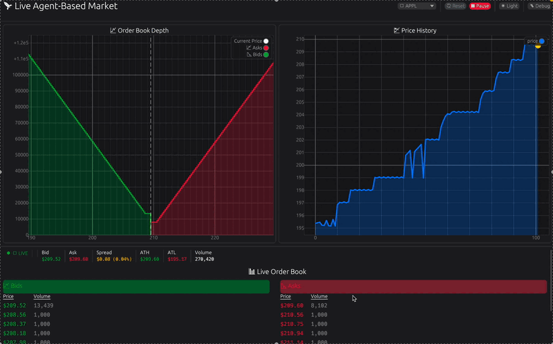

# Market Simulation Platform

This project provides a high-performance, distributed financial market simulator written in Rust. It is designed for research, testing, and analysis of trading strategies and market dynamics within a realistic limit order book environment. The platform enables the simulation of various market participants and their interactions, offering a robust tool for understanding complex market behaviors.

## Key Features

*   **High-Performance Matching Engine:** Implements a true-to-life limit order book with price-time priority matching, partial fills, and cancellations, optimized for speed and concurrency in Rust.
*   **Multi-threaded Event-Driven Architecture:** The market and agents operate in their own threads, communicating through a central event bus and high-speed channels for maximum performance and realism. Agents now react to specific market events rather than constantly polling.
*   **Diverse Agent Ecosystem:** Populated by various agent types, each with distinct behaviors, including purely reactive market makers, and sophisticated **Thermodynamic Agents** that model emergent behavior based on sentiment and market momentum.
*   **Pluggable Agent Framework:** An extensible `Agent` trait in Rust allows for easy development and integration of custom trading agents.
*   **Real-time Communication via gRPC:** Utilizes gRPC for efficient, bi-directional streaming of market data and order flow between the Rust backend and Python clients, enabling external control and observation.
*   **Configurable Market Parameters:** Provides extensive configuration options for tuning agent behaviors, liquidity levels, and other market parameters to simulate diverse market conditions.
*   **Live Visualization:** Includes real-time GUI applications built with `egui` to observe market dynamics, order book depth, and price history as the simulation unfolds.
*   **External Sentiment Integration:** Features a dedicated `SentimentEngine` that consumes real-time sentiment data from an external UDP source, influencing the behavior of Thermodynamic Agents and adding an additional layer of market realism.
*   **Docker Support:** Comprehensive Docker configurations are provided for streamlined setup and deployment of the entire simulation environment.

## Demo



## Planned Features

*   **Live Candle Generation:**
    *   **`Candle` Struct:** A new struct will be created to hold OHLC (Open, High, Low, Close) prices and total volume.
    *   **Live `MarketState` Integration:** The `MarketState` will be updated to include a `HashMap` of `Candle`s for each stock, making live candle data accessible to all agents and observers.
    *   **`ShadowWorker` Updates:** The `ShadowWorker` will be enhanced to update the `Candle` for each trade it processes, building the candles in real-time.

## Architecture

The platform employs a client-server architecture with a clear separation of concerns:

*   **Rust Backend:** This is the core of the simulation, implemented in Rust for its performance and concurrency capabilities. It manages the central `Market` (the exchange), which handles order books, trade execution, and agent state updates. The backend also hosts the gRPC server, exposing the simulation's API.
*   **Central Event Bus:** A `crossbeam-channel` based broadcast system that distributes `MarketEvent`s (Trade, Sentiment, Heartbeat) to all subscribed agents. This is the nervous system of the simulation, enabling efficient and reactive agent behavior.
*   **Agent Ecosystem:**
    *   **Reactive Agents:** Such as the `MarketMakerAgent`, respond directly and deterministically to market events (e.g., trades) to maintain liquidity.
    *   **Thermodynamic Agents:** A new class of agents (`ThermoAgent`) that model complex, emergent behavior. Their internal state (temperature, chemical potential, specific heat) is influenced by external sentiment and market momentum, leading to probabilistic actions. These agents replace the previous "dumb" agents, offering a more nuanced and realistic simulation of retail and speculative traders.
*   **External Sentiment Service:** An independent Rust microservice (located in `sentiment_service/`) that generates and broadcasts real-time sentiment data via UDP. This service acts as an external input to the simulation, providing a dynamic and realistic source of market "mood."
*   **Python Client:** This component serves as the external interface to the simulation. It connects to the Rust gRPC server, allowing users to send various order types (Market, Limit) and receive real-time updates such as order acknowledgments and trade notifications. This enables flexible control and data consumption for external trading algorithms or analysis tools.
*   **gRPC Communication:** Protocol Buffers define the service contract (`market_gateway.proto`), ensuring a language-agnostic and efficient communication layer. A bi-directional streaming RPC facilitates real-time data exchange between the Rust backend and Python clients.

## Technologies Used

*   **Rust:**
    *   `tokio`: Asynchronous runtime for concurrent operations.
    *   `tonic`, `prost`: gRPC framework and Protocol Buffer implementation.
    *   `crossbeam-channel`: High-performance multi-producer, multi-consumer channels (including broadcast).
    *   `parking_lot`, `once_cell`: Concurrency primitives for shared state management.
    *   `eframe`, `egui_plot`: For GUI development and plotting in the visualizer.
    *   `criterion`: Benchmarking framework.
*   **Python:**
    *   `grpcio`, `grpcio-tools`: Python gRPC libraries.
    *   `pytest`: For testing the Python client.
*   **Docker:** For containerization and simplified deployment using `docker-compose`.

## Setup and Installation

### Prerequisites

*   Rust (with Cargo)
*   Python 3.10+
*   Conda (recommended for Python environment management)
*   Docker (if using Docker for deployment)

### Local Setup (without Docker)

1.  **Clone the repository:**
    ```bash
    git clone https://github.com/apoorvasinha183/market_simulator.git
    cd market_simulator
    ```

2.  **Rust Backend Setup:**
    *   Build the Rust project:
        ```bash
        cargo build --release
        ```
    *   Run the gRPC server:
        ```bash
        cargo run --release --bin grpc_server
        ```
        Keep this terminal open as the server will run continuously.

3.  **Run the External Sentiment Service:**
    *   Navigate to the `sentiment_service/sentiment` directory:
        ```bash
        cd sentiment_service/sentiment
        ```
    *   Build and run the sentiment service:
        ```bash
        cargo run --release --bin sentiment_service
        ```
        This service will start broadcasting sentiment data via UDP. Keep this terminal open.

4.  **Python Client Setup:**
    *   Navigate back to the `python_client` directory:
        ```bash
        cd ../python_client
        ```
    *   Create and activate the Conda environment:
        ```bash
        conda env create -f environment.yml
        conda activate market_simulator_env
        ```
    *   Install Python dependencies:
        ```bash
        pip install -r requirements.txt
        ```
    *   Generate gRPC Python stubs (if not already generated or if `.proto` files change):
        ```bash
        python -m grpc_tools.protoc -I../proto --python_out=./market_gateway_client/generated --grpc_python_out=./market_gateway_client/generated ../proto/market_gateway.proto
        ```
    *   Run the Python broker client:
        ```bash
        python run_broker.py
        ```
        This will connect to the Rust server and begin sending orders.

### Docker Setup

1.  **Build and run services using Docker Compose:**
    ```bash
    docker-compose up --build
    ```
    This command will build the Docker images for both the Rust server and Python client, and then start them.
    *Note: You may need to manually start the `sentiment_service` within its container or add it to the `docker-compose.yml` if you wish to run it via Docker.*

## Usage

Once the Rust gRPC server, external sentiment service, and Python client are running:

*   The Rust server's console will display market events, agent actions, and trade executions.
*   The Python client's console will show the orders being sent and any acknowledgments or trade updates received from the server.
*   To run the live market visualizer:
    ```bash
    cargo run --release --bin visual_order
    ```
    This will launch a GUI application providing a real-time view of the order book and price history.
*   **Sending Sentiment:** You can send sentiment data to the `sentiment_service` via UDP. For example, if a stock's sentiment port is `80` (as defined in `stock.csv`), you can use `netcat` or a simple Python script:
    ```bash
    # Using netcat (Linux/macOS)
    echo "0.75" | nc -u -w0 127.0.0.1 80
    ```
    The `ThermoAgent`s will react to these sentiment inputs.

## Project Structure

*   `./`: Root directory, containing `Cargo.toml`, `docker-compose.yml`, `README.md`, etc.
*   `proto/`: Defines the gRPC service contract in `market_gateway.proto`.
*   `src/`: Rust source code for the simulation backend.
    *   `src/agents/`: Implementations of various agent behaviors and configurations, including the new `ThermoAgent`.
    *   `src/bin/`: Executable binaries, including the gRPC server and visualizer.
    *   `src/events/`: Defines the `MarketEvent` enum for the central event bus.
    *   `src/pricing/`: Modules for pricing models.
    *   `src/sentiment_engine/`: Components for consuming external sentiment data.
    *   `src/simulation/`: Core orchestration logic for the simulation.
    *   `src/simulators/`: Implementations of the market and order book.
    *   `src/stocks/`: Definitions and management of stock instruments.
    *   `src/types/`: Fundamental data structures for orders, trades, and other market entities.
*   `sentiment_service/`: An independent Rust project that generates and broadcasts sentiment data via UDP.
*   `python_client/`: Python client application.
    *   `python_client/market_gateway_client/`: Python client logic and generated gRPC files.
    *   `python_client/tests/`: Unit and integration tests for the Python client.
    *   `python_client/environment.yml`, `python_client/requirements.txt`: Python dependency management files.
*   `benches/`: Rust benchmarking code.
*   `tests/`: Rust integration tests.

## Project Roadmap

| Phase | Description | Status |
| :--- | :--- | :--- |
| **Foundation** | Core architecture, multi-threaded orchestra, agent framework | Complete |
| **Core Actors** | Implementation of all major agent types | Complete |
| **Visualization** | Real-time order book and price history visualizer | Complete |
| **Event-Driven Core** | Central event bus, sentiment integration, Thermodynamic Agents | Complete |
| **Testing** | Comprehensive unit and integration tests | In Progress |
| **RL Integration** | A streaming interface (e.g., gRPC) for external policy control | Planned |
| **Options Market** | Dedicated infrastructure for options pricing and trading | Planned |

## License

This project is licensed under the MIT License. See the `LICENSE` file for details.
