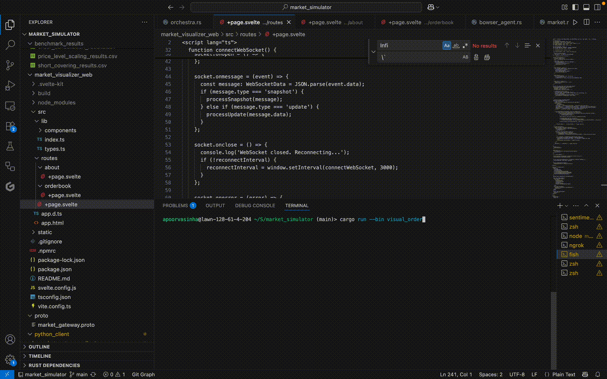

# Market Simulation Platform

This project is a financial market simulator written in Rust. It provides a multi-threaded environment for simulating the dynamics of a limit order book. The platform is designed to facilitate the development and analysis of trading strategies and market microstructure by modeling the interactions of multiple, concurrent market participants.

The system models information asymmetry and concurrency to allow for the study of emergent behaviors that result from agent interactions.

## Features

## Demo



*The different components of the trading simulator in action: CLI, Desktop GUI, Web Frontend and Python Client Integration*

*   **Multi-threaded Core:** The simulation is built on an actor-based architecture in Rust. Components run in separate threads and communicate via channels.
*   **Asynchronous Matching Engine:** The market manages a dedicated, asynchronous order book for each stock, allowing for parallel trade execution.
*   **"Shadow Book" System:** Provides agents with high-speed, read-only snapshots of the market state. This includes a lower-latency data feed for designated agents to model information asymmetry.
*   **Concurrent Agents:** Agents are independent actors running in their own threads. Their decision-making logic is parallelized across the stock universe.
*   **Extensible Agent Framework:** A base `Agent` trait allows for the creation of custom trading agents.
*   **gRPC Interface:** A bidirectional gRPC stream allows external clients to programmatically interact with the simulation.
*   **External Data Integration:** A UDP-based engine allows external data streams to be injected into the simulation as events.
*   **Visualization Tools:** The project includes a native `egui`-based GUI for order book visualization and a Svelte-based web interface.
*   **Tooling:** The repository includes Docker support, unit tests, and benchmarking suites.

## System Design: The Lifecycle of an Order

1.  **Decision:** An **Agent**, running in its own thread, reads from its local "Shadow Book" handle to get the current market state and decides to place an order.
2.  **Submission:** The agent creates an `OrderRequest` and sends it to a central channel connected to the `Market`.
3.  **Dispatch:** The **`Market`** actor receives the request. It assigns a unique ID, sends an `OrderAck` back to the agent, and forwards the request to the dedicated `AsyncOrderBook` actor for that stock.
4.  **Notification:** The `Market` also publishes a `ShadowEvent` to the **`ShadowCoordinator`**, which updates its market view.
5.  **Matching:** The **`AsyncOrderBook`** actor for the stock receives the order and processes it against its canonical order book, generating `Trade`s.
6.  **Execution Report:** These `Trade`s are sent to a central **`TradeProcessor`** thread, which sends reports back to the agents involved (taker and maker).
7.  **State Update:** The agents' portfolio-update threads receive these reports and update their internal state (e.g., cash and inventory).

## Architecture

The platform uses a multi-layered, decoupled architecture.

*   **Core Simulation Actors:**
    *   **`Orchestra`:** The bootstrap module that constructs all components, connects them with communication channels, and launches each in its own thread.
    *   **`Market`:** A central routing actor that directs order flow to the correct order book and broadcasts market-wide events.
    *   **`AsyncOrderBook`:** A dedicated actor for each stock that owns the canonical order book and performs trade matching.
    *   **`Agent`s:** Each agent is an independent actor, running its logic concurrently.

*   **Market Data Subsystem (The Shadow Books):**
    This system is designed to prevent data contention bottlenecks. Instead of giving agents direct access to the live order books, it provides read-only snapshots.
    *   **`ShadowCoordinator`:** A background service that listens to events from the `Market` and builds a "back-buffer" view of the market state.
    *   **`MarketState` Handle:** Periodically, the coordinator swaps this buffer into a front-buffer, which agents can read from with low contention. This provides an eventually consistent view of the market.

*   **External Interfaces:**
    *   **gRPC Server:** Hosted by the `CustomerAgent`, it provides the primary entry point for external clients.
    *   **`SentimentEngine`:** Listens for UDP multicast messages, allowing external data to be injected into the simulation as `MarketEvent`s.

## Technologies Used

*   **Rust:**
    *   `tokio`: Asynchronous runtime.
    *   `tonic`, `prost`: gRPC framework.
    *   `crossbeam-channel`: Channels for actor communication.
    *   `dashmap`, `parking_lot`: Concurrent data structures.
    *   `eframe`, `egui_plot`: For the native GUI visualizer.
    *   `axum`: For the web server.
    *   `criterion`: Benchmarking.
*   **Python:**
    *   `grpcio`, `grpcio-tools`: For the gRPC client.
    *   `pytest`: For testing the Python client.
*   **Web:**
    *   `Svelte`: For the web user interface.
    *   `Vite`: Frontend tooling.
*   **Docker:** For containerization with `docker-compose`.

## Getting Started

### Prerequisites

*   Rust (with Cargo)
*   Python 3.10+
*   Node.js and npm (for the web visualizer)
*   Docker (optional, for containerized deployment)

### Local Setup

1.  **Clone the repository:**
    ```bash
    git clone https://github.com/apoorvasinha183/market_simulator.git
    cd market_simulator
    ```

2.  **Run the Rust gRPC Server:**
    This is the main simulation engine.
    ```bash
    cargo run --release --bin grpc_server
    ```
    Keep this terminal open.

3.  **Run the Python Client (Optional):**
    This client connects to the server and submits orders.
    ```bash
    # Navigate to the python client directory
    cd python_client

    # Use a virtual environment
    python -m venv venv
    source venv/bin/activate
    pip install -r requirements.txt

    # Run the broker
    python run_broker.py
    ```

4.  **Run the Web Visualizer (Optional):**
    This launches a web UI to view market data.
    ```bash
    # Navigate to the web visualizer directory
    cd market_visualizer_web

    # Install dependencies
    npm install

    # Start the development server
    npm run dev
    ```
    Open your browser to the address shown in the terminal.

### Docker Setup

To build and run the stack using Docker Compose:

```bash
docker-compose up --build
```

## Project Structure

*   `./`: Root directory, containing `Cargo.toml`, `docker-compose.yml`, etc.
*   `src/`: The core Rust simulation backend.
    *   `agents/`: Implementations of agent behaviors.
    *   `bin/`: Entry points for executable binaries (`grpc_server`, visualizers).
    *   `market/`: The core market routing logic.
    *   `simulation/`: The `Orchestra` and the "Shadow Book" architecture.
    *   `simulators/`: The `OrderBook` implementation.
*   `proto/`: The gRPC service contract (`market_gateway.proto`).
*   `python_client/`: The Python client for interacting with the simulation.
*   `market_visualizer_web/`: The Svelte-based web frontend.
*   `sentiment_service/`: A separate Rust project that can broadcast sentiment data.
*   `benches/`: Performance benchmarks for the Rust core.
*   `tests/`: Integration tests for the Rust core.

## License

This project is licensed under the MIT License. See the `LICENSE` file for details.


---

### A Note on Tooling
The architecture and core system design of this project are my own. To accelerate development and focus on the higher-level design, AI assistants were used for generating boilerplate code, documentation, and unit tests.